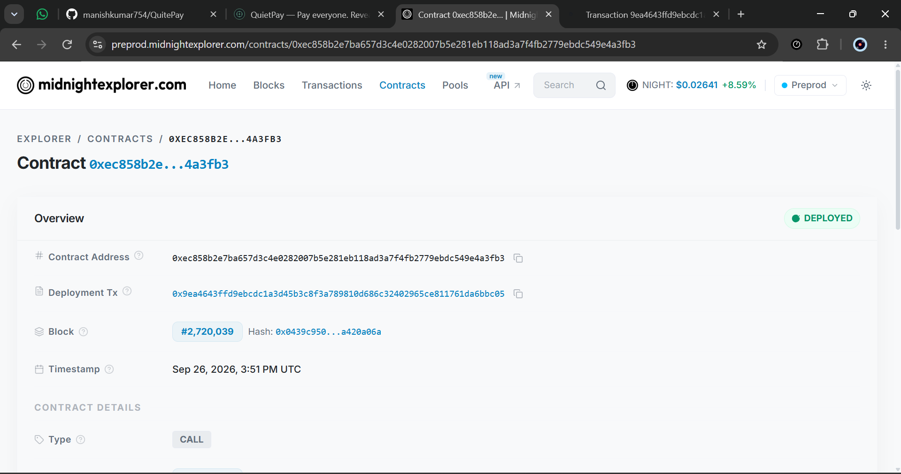
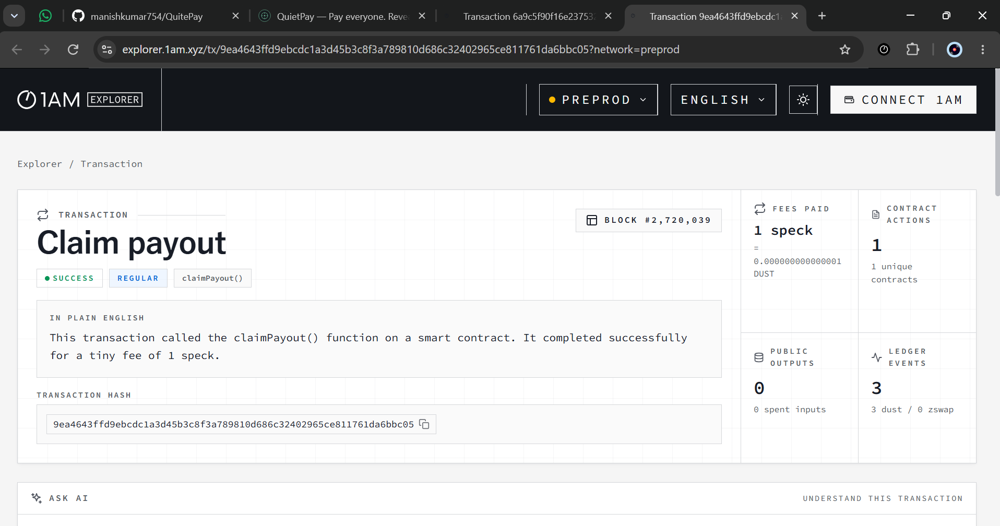
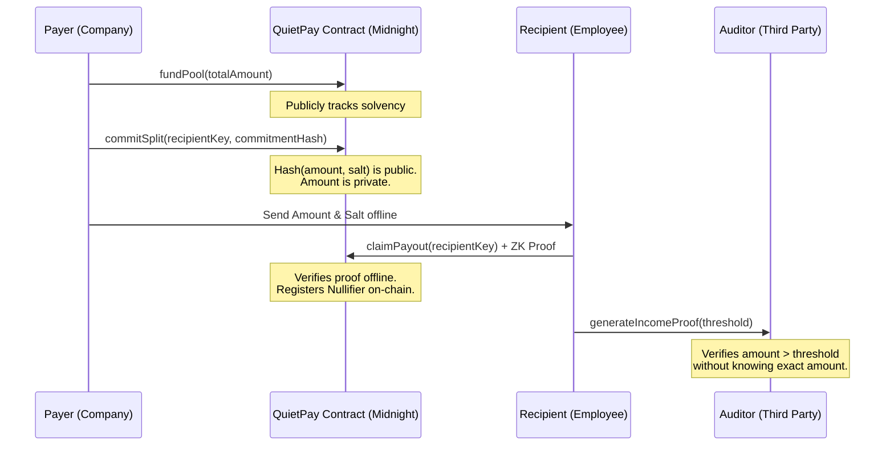
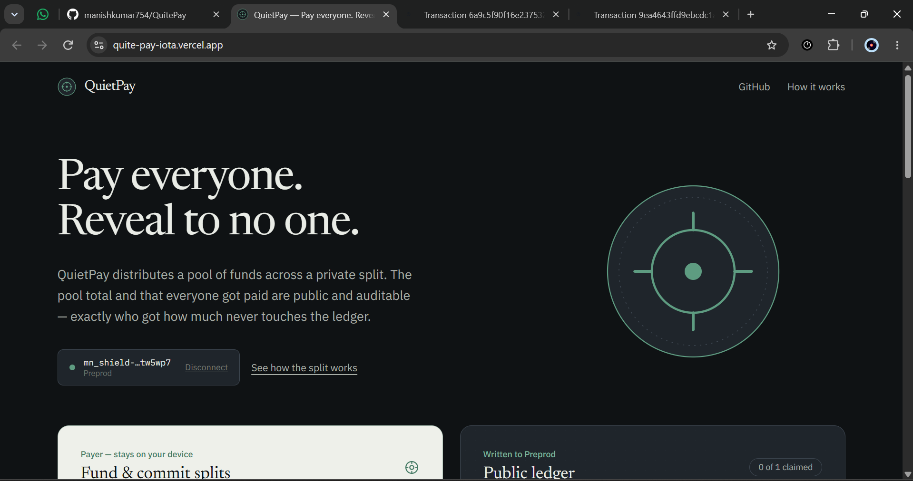
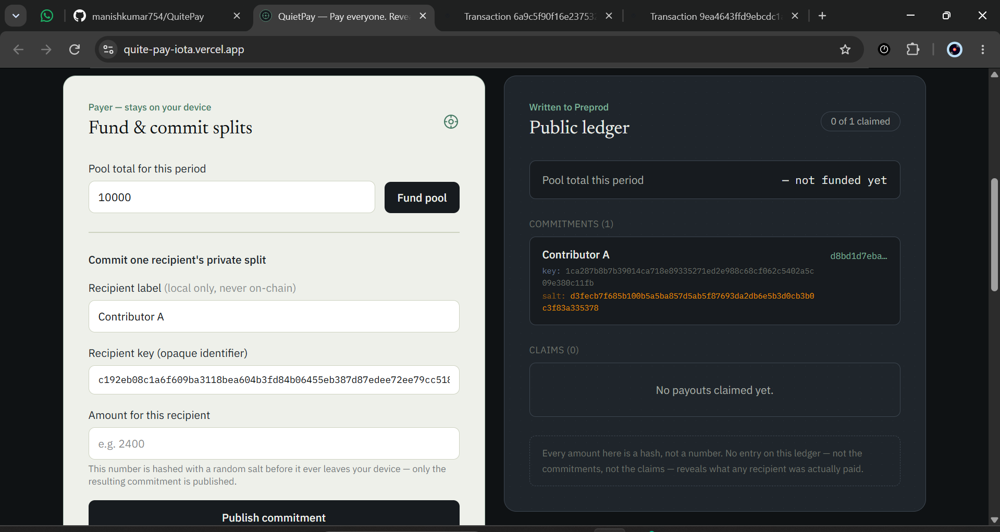
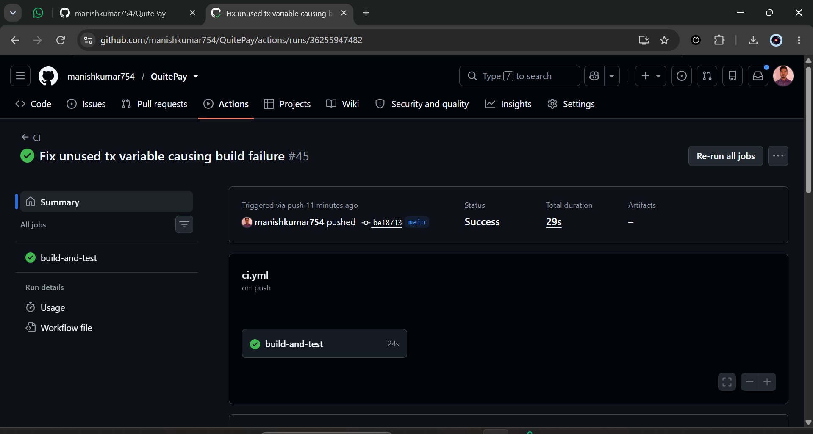

# Project Title
**QuietPay**


> Pay everyone. Reveal to no one.

## Live Demo & Video
- **Live MVP:** https://quite-pay-iota.vercel.app
- **Video Demo:** [Watch the MVP Demo on Google Drive](https://drive.google.com/file/d/18OfcwmqD3VmO2GF-HplJ--C2U1YneOTs/view?usp=sharing)

---

## Project Description

Payroll is one of the strongest arguments for using a blockchain — trustless execution, no intermediary, auditable proof that everyone got paid — and one of the worst fits for a *public* one, because every recipient's exact compensation would become permanently visible to anyone who looks.

QuietPay separates the two facts that get conflated: **that a pool was funded and distributed correctly** (public, auditable) from **who got how much** (private, provable only by the recipient, to whomever they choose). A payer funds a pool and commits a hash of each recipient's amount. Recipients claim by proving their private amount matches the commitment — the ledger only ever records a nullifier and a claimed flag. A recipient can also prove "I was paid at least X" to a third party, like a lender, without revealing the amount to that party or to QuietPay itself.

---

## Project Vision

It's built for DAOs distributing contributor payouts, teams running crypto-native payroll, and revenue-split pools — anywhere a group needs trustless, on-chain fund distribution without turning compensation into public information.

Midnight is the natural fit because `disclose()` forces every public exposure to be a deliberate, auditable choice in the contract code — rather than "everything is public unless you build an entire off-chain layer to hide it," which is how every other chain handles this problem today.

---

## Key Features

- **Auditable Solvency:** Total payroll pool size is fully public on-chain, proving solvency.
- **Private Compensation:** The exact amount each recipient receives is completely hidden from the public and even from the smart contract itself using Zero-Knowledge proofs.
- **Nullifier-Based Claims:** Claims are executed using one-way cryptographic nullifiers, ensuring double-claiming is impossible without linking an individual's identity to a specific transaction.
- **Income Proving:** Built-in Zero-Knowledge circuit that allows an employee to prove to a third party (e.g., a lender or auditor) that their salary is above a certain threshold, *without* revealing their exact income or doxxing their identity.

---

## Mainnet / Testnet Contract Details

**Network:** Midnight Preprod (Testnet)
**Contract Address:** `ec858b2e7ba657d3c4e0282007b5e281eb118ad3a7f4fb2779ebdc549e4a3fb3`
[View on Midnight Explorer](https://preprod.midnightexplorer.com/contracts/0xec858b2e7ba657d3c4e0282007b5e281eb118ad3a7f4fb2779ebdc549e4a3fb3)

**Example Claim Transaction:** `9ea4643ffd9ebcdc1a3d45b3c8f3a789810d686c32402965ce811761da6bbc05`
[View on 1AM Explorer](https://explorer.1am.xyz/tx/9ea4643ffd9ebcdc1a3d45b3c8f3a789810d686c32402965ce811761da6bbc05?network=preprod)

### Screenshots of Contract on Block Explorers



---

## Future Scope

- **Real Token Integration:** Upgrading the application to handle real token transfers instead of a counter-based pool.
- **ZK Multi-Sig Payers:** Allowing decentralized autonomous organizations (DAOs) to authorize batch payroll using a multi-signature zk-proof scheme.
- **Automated Recurring Billing:** Smart contract logic to allow standing authorization for monthly streaming payroll without needing explicit monthly sign-offs.

---

## Architecture Diagrams



---

## User Onboarding Detail

### Prerequisites
- [Node.js](https://nodejs.org) v20 or later
- npm (bundled with Node)
- [Lace wallet](https://www.lace.io) / [1AM Wallet](https://1am.xyz/) with the Midnight Preprod network enabled
- The [Compact compiler CLI](https://docs.midnight.network) (`compact`)

### Setup & Run Locally
```bash
# 1. Clone the repo
git clone https://github.com/manishkumar754/QuitePay.git
cd QuitePay

# 2. Install frontend dependencies
npm install

# 3. Compile the Compact contract
compact compile contracts/quietpay.compact managed/quietpay

# 4. Run the frontend locally
npm run dev
```

### Usage Instructions
See the detailed walkthrough in [`docs/USAGE.md`](docs/USAGE.md).

---

## Social Media Handle Links

- **QuietPay X Profile:** [QuietPay X Profile](https://x.com/quietpayS)
- **Launch Tweet:** [Launch Thread](https://x.com/quietpayS/status/2103888560378277949)

---

## Additional Screenshots
### 1. QuietPay UI


### 2. Public Ledger State


### 3. CI/CD Pipeline Passing

